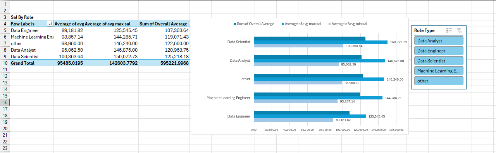
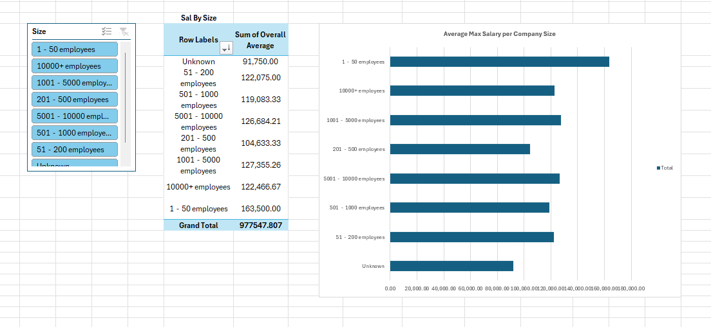
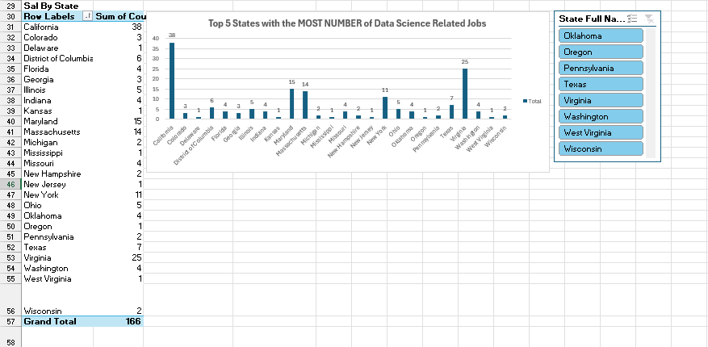
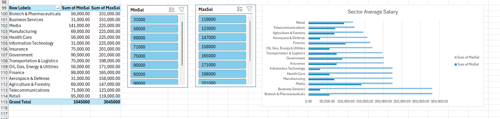

# Midterm Lab Task 3 - Creating Pivot Table and Dashboard

## Step 1
- Use the Worksheet on Uncleaned DS Jobs and Transform Tables
- Analyze Salary Data
- Salary by Role
- Salary by State
- Salary by Company Size

## Step 2 
- State with the most Data Science jobs
- Job role with the highest average salary (Complete the dashboard)
- Company size that pays the highest salary (Complete the dashboard)
- Sector employing the least and most Data Science-related jobs
- Sector with the minimum and maximum average salary
- Note: Create a PIVOT Table query for sector-based insights

## Step 3 
- Create Necessary Pivot Tables & Charts
- Use appropriate visualizations for reports
- Insert Slicers for: Role Type, Company Size, State
- Insert Map (Optional).

## Dashboard Image

## Salary by Role

## Salary by Size

## Salary by State

## Sector by Average Salary

## Sector by Size

